# System Architecture For EDGESTACK.AI 


### Key Architectural Decisions
- Edge-first architecture using Cloudflare Workers
- Real-time collaboration through Durable Objects
- Local-first data management with TinyBase
- Multi-tenant isolation per organization
- Event-driven notification system

### System Capabilities
- Offline-first operation
- Multi-tenant isolation
- Plugin extensibility
- Integrated notification system

## Core Components

### Edge Computing Layer

**Responsibilities:** Processes data and serves requests at the network edge, minimizing latency and improving performance for globally distributed users through Cloudflare Workers and Durable Objects.

**Key Technologies:**
- Cloudflare Workers: Edge computing platform
- Durable Objects: Stateful edge computing
- Turso: Edge database
- R2: Edge storage
- WebSockets: Real-time communication

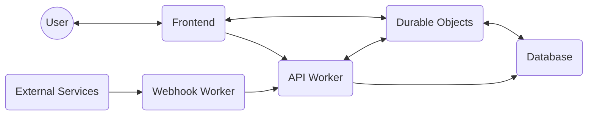

**Key Features:**
- Global request routing
- Edge state management
- Real-time data processing
- File operations at edge
- WebSocket connections

**Edge Processing:**
1. Request routing to nearest edge
2. State management via Durable Objects
3. Data persistence with Turso
4. File handling with R2
5. Real-time WebSocket connections

### API Layer

**Responsibilities:** Provides a secure, type-safe HTTP API layer at the edge, handling external requests, authentication, and business logic while ensuring organization-level data isolation.

**Key Technologies:**
- Hono: Edge-optimized web framework
- Drizzle: Type-safe SQL toolkit
- Zod: Runtime type validation
- Clerk: Authentication & user management
- Turso: Edge database

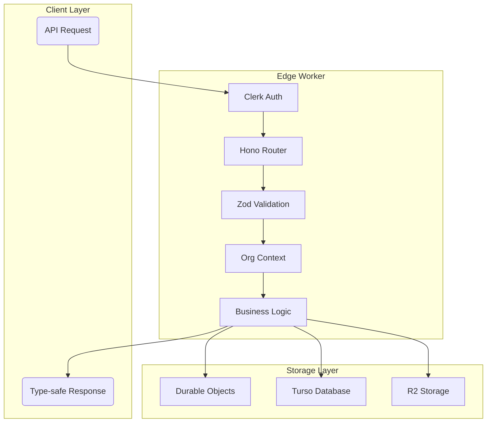

**Key Features:**
- Organization context middleware
- Type-safe database queries with Drizzle
- Real-time state synchronization
- Webhook event processing
- Error boundary handling

**Request Flow:**
1. Request hits edge location
2. Authentication via Clerk middleware
3. Organization context resolution
4. Request validation with Zod
5. Business logic execution
6. Real-time updates via DO if needed
7. Database operations with Turso
8. Type-safe response generation

**Technologies:**
- Hono: Edge-optimized web framework
- Drizzle: Type-safe SQL toolkit
- Zod: Runtime type validation
- Clerk: Authentication & user management
- Turso: Edge database

### Real-time Collaboration Engine

**Responsibilities:** Manages real-time state synchronization between clients using WebSocket-based synchronization through Durable Objects. Handles change broadcasting, offline state reconciliation, transaction management, and persistent storage.

**Key Technologies:** 
- Durable Objects: Manages WebSocket server, real-time state, and storage
- TinyBase: Local-first data store with built-in synchronization capabilities
- WebSockets: Real-time communication channel
- Turso: Edge database for long-term persistence
- LibSQL: Database client for Turso integration

**Data Flow and Local-First Architecture:**

1. **Local State Management:**
   - Each client maintains a MergeableStore in the browser
   - All user interactions first update this local store
   - Changes are tracked using TinyBase's transaction system
   - UI updates happen immediately from the local store
   - Local changes are persisted using LibSqlPersister
   - Works offline through TinyBase's CRDT capabilities

2. **Synchronization Flow:**
   ```mermaid
   graph TB
       subgraph Client["Browser"]
           Local("MergeableStore")
           WsSync("WsSynchronizer")
           LocalDB("LibSqlPersister")
           
           Local --> LocalDB
           Local --> WsSync
       end
       
       subgraph Edge["Durable Object"]
           DO("WsServerDurableObject")
           DOStore("MergeableStore")
           Storage("DurableObjectStoragePersister<br/>Active State Cache")
           
           DO <-->|State| DOStore
           DOStore <-->|Cache| Storage
       end
       
       DB["Turso Database<br/>Source of Truth"]
       Other("Other Clients")
       
       WsSync -->|1 Changes| DO
       DO -->|2 Broadcast| Other
       DO -->|3 Persist| DB
       DB -->|4 HTTP Push| DO
       DO -->|5 Update| WsSync
       WsSync --> Local
   ```

3. **Step-by-Step Process:**

   a. **Local Changes:**
      - User makes changes in the application
      - Changes are immediately applied to MergeableStore
      - UI updates instantly through TinyBase reactivity
      - Changes are saved using LibSqlPersister
      - Changes are queued for WsSynchronizer

   b. **State Management:**
      - DO's MergeableStore handles active state
      - DurableObjectStoragePersister provides fast edge caching
      - Turso serves as the persistent source of truth
      - DO can recover from either storage layer based on needs
      - Storage layers have different durability guarantees:
        * DO Storage: Fast, edge-local, size-limited
        * Turso: Durable, globally replicated, unlimited
      - Cache Management:
        * DO storage is cleared on successful Turso persistence
        * Only keeps most recent state for active sessions
        * Automatically recovers from Turso if cache is cleared
        * Uses Turso as backup when cache limit is reached
        * Cache invalidation triggered by:
          - Successful Turso writes
          - Storage limit warnings
          - DO instance recycling
          - Explicit cache clear commands

   c. **Synchronization:**
      - WsSynchronizer sends changes to WsServerDurableObject
      - DO applies changes to its own MergeableStore instance
      - DO broadcasts to other connected clients
      - Changes are stored in DurableObjectStoragePersister
      - Changes are persisted to Turso via LibSqlPersister
      - Other clients receive and apply changes to their MergeableStore

   d. **Database Change Handling:**
      - Each DO exposes an HTTP endpoint for database updates
      - Turso pushes changes directly to DO's endpoint
      - DO updates its MergeableStore with received changes
      - Changes are automatically broadcast to connected clients
      - No polling or additional services required
      - Each organization's DO self-registers its webhook URL

   e. **Offline and Recovery:**
      - Changes continue in local MergeableStore when offline
      - All changes are stored in LibSqlPersister
      - Upon reconnection, WsSynchronizer automatically syncs
      - Conflicts are resolved using TinyBase's CRDT system
      - DOs can recover state from either Storage or Turso

   f. **State Recovery:**
      - New clients first load state from WsServerDurableObject
      - DO serves state from its MergeableStore instance
      - If DO is new/empty, state loads from Turso
      - Clients receive real-time updates through WsSynchronizer
      - LibSqlPersister provides fast access to historical data

### Type Safety System

**Responsibilities:** Ensures consistent types from database layer through to the client, providing runtime validation and compile-time type checking across the entire application stack.

**Key Technologies:**
- Drizzle: Database type safety
- Zod: Runtime validation
- TanStack Router: Type-safe routing
- TypeScript: Static type checking
- Shared type definitions via `@api-types`

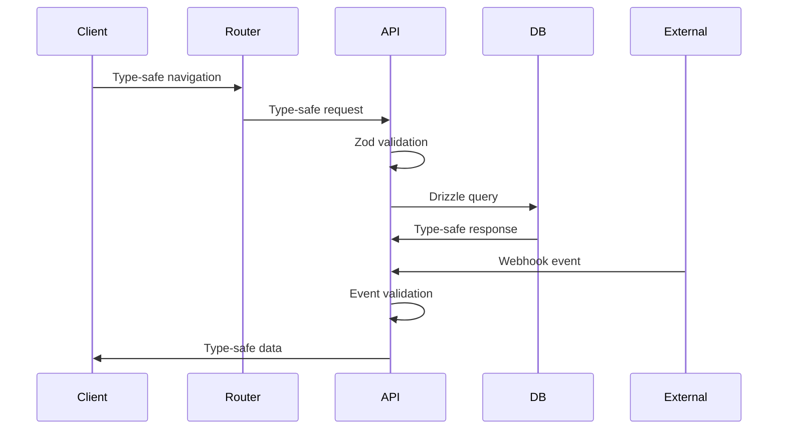

**Core Type Flow:**
1. Database schema defines base types
2. Drizzle generates TypeScript types
3. Zod schemas validate at runtime
4. Shared types distributed via `@api-types`
5. Client consumes type-safe data

**Key Features:**
- End-to-end type safety
- Runtime validation
- Webhook type safety
- Route type safety
- Schema organization
- Error handling types

**Common Pitfalls Prevention:**
1. No type assertions without validation
2. No circular type dependencies
3. Single source of truth for schemas
4. Required webhook signature verification
5. No generic object types

### Frontend System

**Responsibilities:** Provides a modern, type-safe React application with real-time capabilities, responsive design, and a component-driven architecture.

**Key Technologies:**
- React: UI framework
- TanStack Router: Type-safe routing
- TinyBase: Real-time state management
- Shadcn/ui: Component library
- TailwindCSS: Styling
- Vite: Build tool

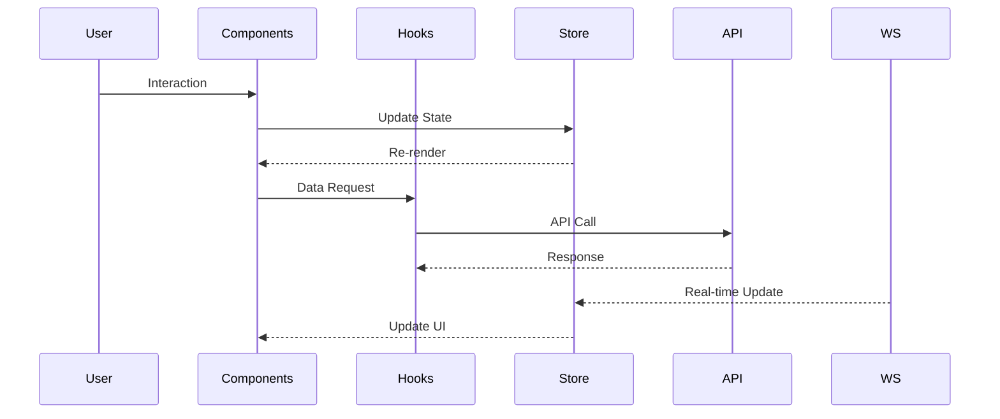

**Core Features:**
1. Component Architecture
   - Reusable UI components
   - Layout system
   - Theme support
   - Responsive design

2. State Management
   - TinyBase for real-time state
   - Local-first data management
   - WebSocket synchronization
   - Form handling

3. Data Flow
   - Real-time updates
   - Offline support
   - Type-safe operations
   - Error handling

4. User Experience
   - Dark/light themes
   - Responsive layouts
   - Loading states
   - Error boundaries

**Key Components:**
- Layout: Header, Sidebar, Main
- Data Display: Tables, Cards, Lists
- Navigation: Tabs, Menus, Breadcrumbs
- Forms: Inputs, Selects, Validation
- Feedback: Notifications, Alerts, Toasts

### Authentication & Authorization

**Responsibilities:** Manages user authentication, session handling, and authorization across the platform, ensuring secure access to resources and maintaining organization-level security boundaries.

**Key Technologies:**
- Clerk: Authentication provider
- Hono Clerk Auth: Edge middleware

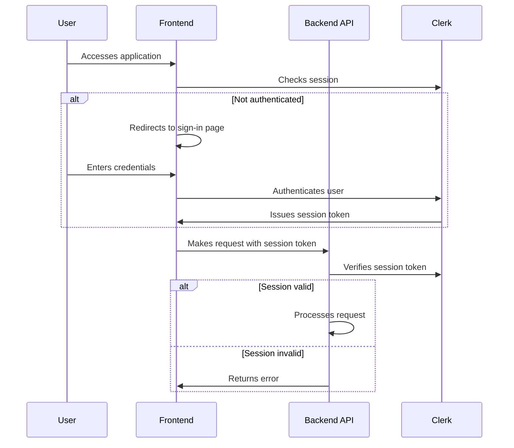

**Frontend Integration:**
- Uses `@clerk/clerk-react` for managing user authentication states and UI components
- `ClerkProvider` wraps the application, handling session management
- Provides hooks like `useAuth` and `useUser` to access authentication state
- Custom sign-in and sign-up pages with Clerk's components

**Backend Integration:**
- Uses `@hono/clerk-auth` middleware to protect API routes
- Verifies Clerk session token in request headers
- Extracts authentication information via Hono context
- Processes Clerk webhooks for user events synchronization

### File Operations Layer

**Responsibilities:** Manages secure file uploads, downloads, and storage operations using R2 for edge-optimized file access and Durable Objects for real-time state tracking.

**Key Technologies:**
- R2: Edge file storage
- Durable Objects: File state tracking
- Presigned URLs: Secure access
- WebSockets: Upload progress
- Workers: Edge processing

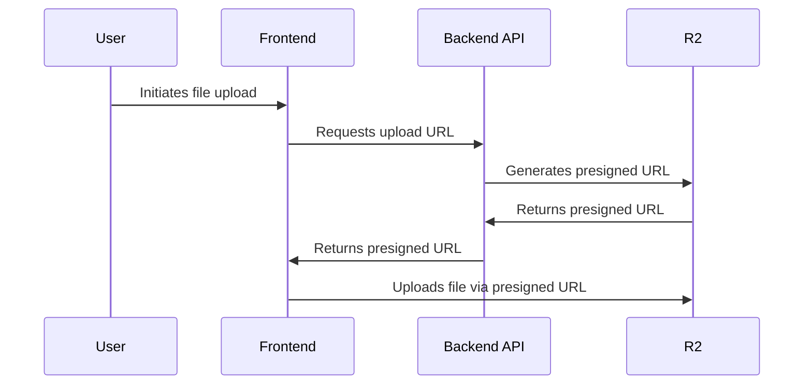

**Core Features:**
1. Upload Management
   - Presigned URL generation
   - Direct-to-R2 uploads
   - Progress tracking
   - Metadata management
   - Real-time notifications

2. Download Operations
   - Secure URL generation
   - Access control
   - Usage tracking
   - Cache management
   - Rate limiting

3. Storage Operations
   - File organization
   - Version control
   - Garbage collection
   - Backup management
   - Storage optimization

### Notification System

**Responsibilities:** Manages real-time notifications, alerts, and system messages to users across the platform, integrated with our Worker-based architecture.

**Key Technologies:** 
- API Worker: Handles notification endpoints and business logic
- Webhook Worker: Processes external notification triggers
- Durable Objects: Real-time notification state and delivery
- TinyBase: Local notification store
- Turso: Persistent notification storage
- R2: Notification asset storage

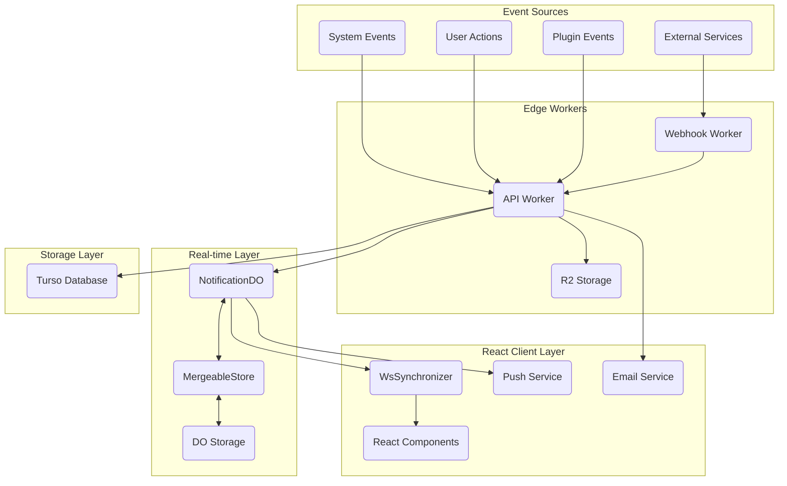

**React Client Architecture:**
- **Component Structure:**
  * NotificationProvider wraps app for context/state
  * NotificationBell shows global notification status
  * NotificationCenter manages notification list/actions
  * NotificationToasts for temporary alerts
  * NotificationPreferences for settings

- **State Management:**
  * TinyBase store with notification tables
  * React hooks for real-time updates
  * Local persistence via LibSqlPersister
  * Optimistic UI updates
  * Shared WebSocket connection

- **Real-time Updates:**
  * WsSynchronizer for WebSocket management
  * TinyBase hooks for reactive updates
  * Automatic reconnection handling
  * Offline state management
  * Cross-tab synchronization

- **User Experience:**
  * Browser notifications via Web API
  * Service Worker for push support
  * Tab badge updates
  * Sound notifications (optional)
  * Notification grouping
  * Read/unread tracking

### Event Processing Layer

**Responsibilities:** Processes and manages external events and webhooks from various services, ensuring reliable event handling, validation, and integration with the core system.

**Key Technologies:**
- Webhook Worker: Event processing
- Svix: Webhook validation
- Hono: HTTP handling
- Zod: Event validation
- Queue Storage: Event buffering

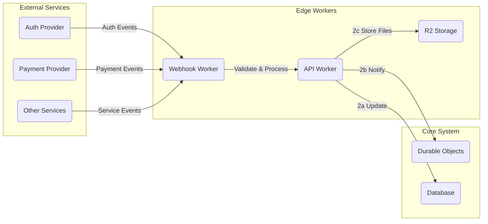

## Implementation Details

### Development Environment

**Local Setup:**
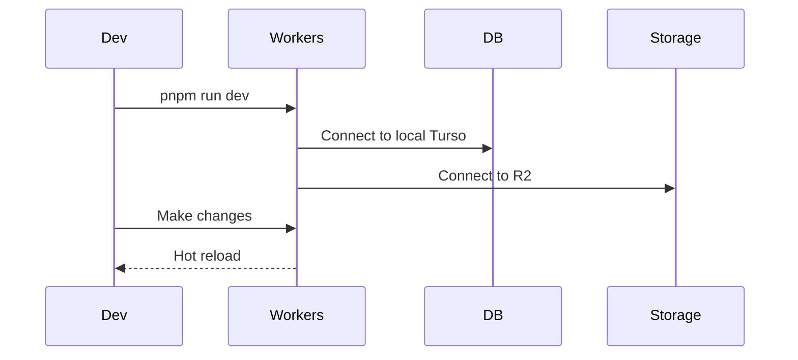

**Key Commands:**
- Setup: `pnpm install`
- Development: `pnpm run dev`
- Testing: `pnpm run test`
- Build: `pnpm run build`
- Deploy: `pnpm run deploy`

### Code Organization

**Project Structure:**
```
apps/
├── api/                 # API Worker
│   ├── src/
│   │   ├── routes/     # API endpoints
│   │   ├── models/     # Data models
│   │   └── services/   # Business logic
│   └── package.json
├── webhook/            # Webhook Worker
│   ├── src/
│   │   ├── handlers/   # Event handlers
│   │   └── services/   # Processing logic
│   └── package.json
└── web/               # Frontend
    ├── src/
    │   ├── components/ # React components
    │   ├── hooks/      # Custom hooks
    │   └── stores/     # TinyBase stores
    └── package.json
```

### Cross-Cutting Concerns

**Security:**
- Per-organization data isolation
- Authentication flows
- API security
- WebSocket security
- Rate limiting

**Observability:**
- Performance metrics
- Error monitoring
- Usage analytics
- Health checks
- Audit logging

**Reliability:**
- Error handling
- Circuit breakers
- Recovery procedures
- Cache management
- Data backups

### CI/CD Pipeline

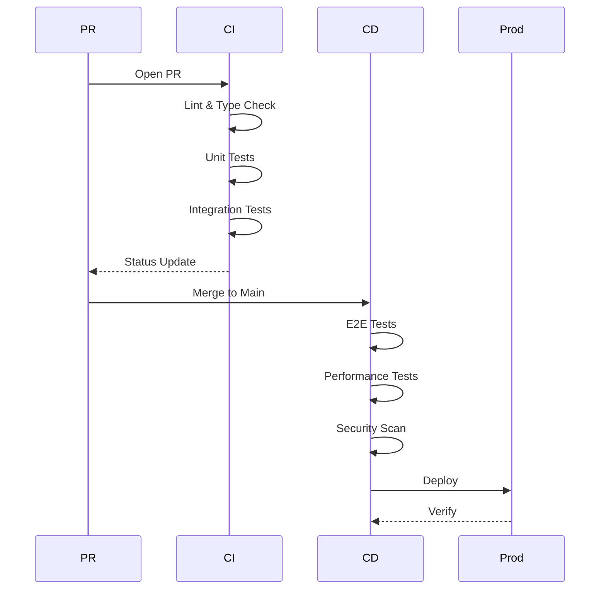

## Tenancy Architecture

### Overview

The system supports three distinct tenancy models to accommodate different use cases:

1. **Internal Model:**
   - Single user table architecture
   - Direct user management without organization layer
   - Simplified authentication flow
   - Optimized for internal business tools
   - Streamlined access control
   - Efficient business workflow support
   - Shared infrastructure and resources

2. **Single Tenant Model:**
   - Complete per-user data isolation
   - Individual user customization options
   - Dedicated storage per user
   - Simplified deployment model
   - User-specific configurations
   - Independent data management
   - Enhanced privacy controls

3. **Multi Tenant Model:**
   - Full organization and team support
   - Cross-organization security boundaries
   - Resource sharing capabilities
   - Team member management
   - Organization-level customization
   - Role-based access control
   - Collaborative features

### Resource Allocation

Each model provides different resource management approaches:

**Internal Model:**
- Shared user table
- Common resource pool
- Unified authentication
- Centralized management

**Single Tenant Model:**
- Isolated user data
- Individual resource allocation
- Personal customization
- Independent scaling

**Multi Tenant Model:**
- Organization-level isolation
- Team resource sharing
- Cross-org boundaries
- Hierarchical management

### Architecture Pattern

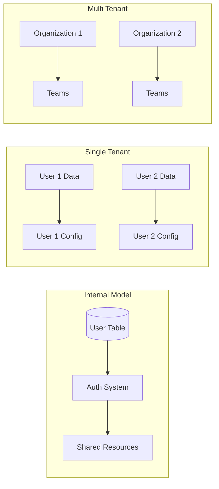


## Future Components

### Plugin System

**Responsibilities:** Enables extending the system's functionality through a plugin system (planned feature).

**Key Technologies:** TypeScript, well-defined interfaces.

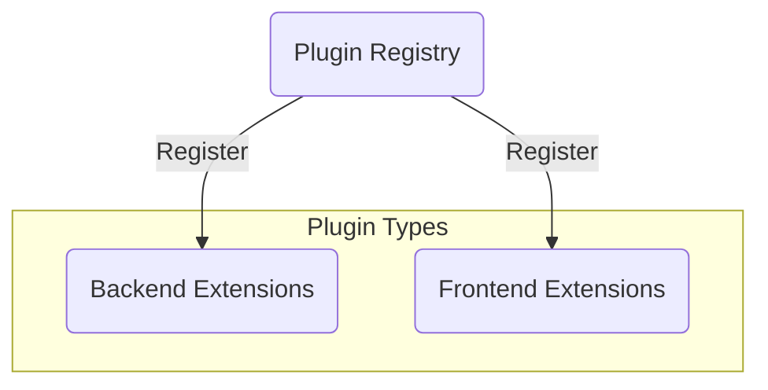

The plugin system will provide extension points for both backend and frontend functionality, with a central registry for managing plugins.

## Alignment with Goals and Metrics

### Technical Excellence
- **Edge Computing:** Achieved through Cloudflare Workers
- **Type Safety:** Comprehensive TypeScript usage
- **Testing:** Extensive test coverage
- **Performance:** Sub-100ms response times
- **Security:** Multi-layered security model

### User Experience
- **Real-time:** Instant updates via WebSocket
- **Offline:** Local-first architecture
- **Performance:** Edge-optimized responses
- **Reliability:** Multi-layer redundancy
- **Security:** Enterprise-grade security

### Business Impact
- **Scalability:** Edge-native architecture
- **Reliability:** 99.99% uptime target
- **Cost:** Pay-per-use model
- **Time-to-Market:** Rapid deployment
- **Extensibility:** Plugin system

## Conclusion

This architecture provides a robust foundation for building a scalable, real-time collaborative platform:

### Key Strengths
- Edge-first design for global performance
- Real-time collaboration capabilities
- Strong security and isolation
- Extensive monitoring and observability
- Comprehensive development tooling

### Future Directions
- Enhanced plugin ecosystem
- Advanced analytics capabilities
- Extended offline capabilities
- Improved development experience
- Enhanced monitoring tools

The architecture successfully balances technical excellence, user experience, and business impact, providing a solid foundation for future growth and innovation.
