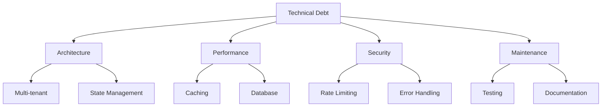

# Technical Debt Management

This notebook describes our system for tracking and managing technical debt across the Admin Cloudflare project.

## Overview

Technical debt is tracked and managed using a systematic approach that includes:
- Debt classification and categorization
- Priority scoring and risk assessment
- Impact analysis framework
- Remediation planning tools

## 1. Debt Classification System

### Categories


### Architecture Debt
- Multi-tenant complexity in single-tenant context
- State management migration needs
- Service isolation improvements
- Data flow optimization

### Performance Debt
- Caching strategy optimization
- Database schema improvements
- Connection pooling implementation
- Edge caching implementation

### Security Debt
- Rate limiting enhancements
- Error handling improvements
- Session management gaps
- Security headers implementation

### Maintenance Debt
- Testing coverage gaps
- Documentation needs
- Development tooling
- Code organization

## 2. Priority Scoring Framework

### Risk Levels

#### High Risk
- Security vulnerabilities
- Performance bottlenecks
- Data consistency issues
- State management complexity

#### Medium Risk
- Testing coverage gaps
- Documentation needs
- Caching inefficiencies
- Error handling improvements

#### Low Risk
- UI inconsistencies
- Code organization
- Development tooling
- Minor optimizations

### Impact Assessment
```typescript
interface ImpactMetrics {
  security: {
    severity: 'high' | 'medium' | 'low';
    scope: 'system' | 'component' | 'feature';
    urgency: number; // 1-5
  };
  performance: {
    userImpact: number; // 1-5
    systemLoad: number; // 1-5
    scalability: number; // 1-5
  };
  maintenance: {
    complexity: number; // 1-5
    documentation: number; // 1-5
    testability: number; // 1-5
  };
}
```

## 3. Remediation Planning

### Immediate Actions
```typescript
interface ActionItem {
  id: string;
  category: 'security' | 'performance' | 'maintenance';
  priority: 'high' | 'medium' | 'low';
  effort: number; // story points
  dependencies: string[];
  version: string; // target version
}
```

### Long-term Strategy
1. Regular debt assessment meetings
2. Integration with sprint planning
3. Continuous monitoring
4. Prevention practices

## 4. Prevention Strategy

### Code Review Guidelines
```typescript
interface ReviewChecklist {
  security: {
    rateLimit: boolean;
    inputValidation: boolean;
    authentication: boolean;
    authorization: boolean;
  };
  performance: {
    caching: boolean;
    optimization: boolean;
    monitoring: boolean;
  };
  maintenance: {
    testing: boolean;
    documentation: boolean;
    typeChecking: boolean;
  };
}
```

### Monitoring System
```typescript
interface DebtMetrics {
  testCoverage: number;
  documentationCoverage: number;
  codeQuality: {
    complexity: number;
    duplication: number;
    maintainability: number;
  };
  performance: {
    responseTime: number;
    errorRate: number;
    resourceUsage: number;
  };
}
```

## 5. Integration with Development Process

### Sprint Planning
1. Debt assessment in refinement
2. Priority alignment with features
3. Regular debt sprints
4. Progress tracking

### Release Planning
1. Debt quotas per release
2. Impact assessment
3. Version targeting
4. Migration paths

## 6. Tooling and Automation

### Static Analysis
```typescript
interface AnalysisConfig {
  tools: {
    eslint: boolean;
    prettier: boolean;
    typescript: boolean;
  };
  thresholds: {
    complexity: number;
    coverage: number;
    duplication: number;
  };
  reporting: {
    frequency: 'daily' | 'weekly' | 'sprint';
    targets: string[];
  };
}
```

### Monitoring Integration
1. Performance metrics
2. Error tracking
3. Usage analytics
4. Resource monitoring

## Usage Guidelines

### For Developers
1. Regular debt reporting
2. Impact assessment
3. Prevention practices
4. Monitoring review

### For Product Management
1. Priority alignment
2. Resource allocation
3. Version planning
4. Progress tracking

### For Technical Leads
1. System oversight
2. Process improvement
3. Tool selection
4. Team guidance 