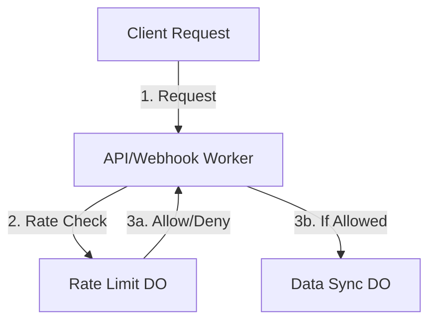

# Rate Limiting Durable Object Implementation (v0.2.1)

## Version History
- v0.2.1: Initial implementation with core rate limiting functionality
  - Independent rate limiting layer
  - Request pipeline protection
  - Per-route configuration
  - Multi-scope support (IP, user, organization)
  - Basic metrics collection

## Overview
Independent rate limiting system using Durable Objects for the API and Webhook workers. This system operates separately from the data synchronization layer, providing request control without impacting real-time collaboration features.

## System Architecture



## Implementation

### Rate Limit Configuration
```typescript
interface RateLimitConfig {
  routes: Record<string, {
    limit: number;
    window: number;
    scope: 'ip' | 'user' | 'organization';
  }>;
}

interface RateLimitEntry {
  count: number;
  firstRequest: number;
  lastRequest: number;
}

interface RateLimitState {
  entries: Map<string, RateLimitEntry>;
  config: RateLimitConfig;
}
```

### Durable Object Class
```typescript
export class RateLimitDO {
  private state: DurableObjectState;
  private store: Map<string, RateLimitEntry>;
  private config: RateLimitConfig;

  constructor(state: DurableObjectState, env: Env) {
    this.state = state;
    this.store = new Map();
    this.config = {
      routes: {
        default: {
          limit: 100,
          window: 60, // seconds
          scope: 'ip'
        }
      }
    };
  }

  async initialize() {
    const stored = await this.state.storage?.get<RateLimitState>('state');
    if (stored) {
      this.store = new Map(Object.entries(stored.entries));
      this.config = stored.config;
    }
  }

  private async persist() {
    await this.state.storage?.put('state', {
      entries: Object.fromEntries(this.store),
      config: this.config
    });
  }

  private getKey(req: Request, route: string): string {
    const config = this.config.routes[route] || this.config.routes.default;
    switch (config.scope) {
      case 'ip':
        return req.headers.get('cf-connecting-ip') || 'unknown';
      case 'user':
        return req.headers.get('x-user-id') || 'anonymous';
      case 'organization':
        return req.headers.get('x-organization-id') || 'unknown';
      default:
        return 'default';
    }
  }

  async handleLimit(req: Request): Promise<Response> {
    const route = new URL(req.url).pathname;
    const key = this.getKey(req, route);
    const config = this.config.routes[route] || this.config.routes.default;
    const now = Date.now();

    // Clean up old entries
    this.cleanup();

    // Get or create entry
    let entry = this.store.get(key);
    if (!entry) {
      entry = { count: 0, firstRequest: now, lastRequest: now };
      this.store.set(key, entry);
    }

    // Check if window has expired
    if (now - entry.firstRequest > config.window * 1000) {
      entry = { count: 0, firstRequest: now, lastRequest: now };
      this.store.set(key, entry);
    }

    // Check limit
    if (entry.count >= config.limit) {
      return new Response('Rate limit exceeded', {
        status: 429,
        headers: {
          'X-RateLimit-Limit': config.limit.toString(),
          'X-RateLimit-Remaining': '0',
          'X-RateLimit-Reset': new Date(entry.firstRequest + config.window * 1000).toISOString()
        }
      });
    }

    // Increment counter
    entry.count++;
    entry.lastRequest = now;
    await this.persist();

    return new Response('OK', {
      status: 200,
      headers: {
        'X-RateLimit-Limit': config.limit.toString(),
        'X-RateLimit-Remaining': (config.limit - entry.count).toString(),
        'X-RateLimit-Reset': new Date(entry.firstRequest + config.window * 1000).toISOString()
      }
    });
  }

  private cleanup() {
    const now = Date.now();
    for (const [key, entry] of this.store.entries()) {
      const config = this.config.routes.default;
      if (now - entry.firstRequest > config.window * 1000) {
        this.store.delete(key);
      }
    }
  }

  // Admin methods for configuration
  async updateConfig(newConfig: Partial<RateLimitConfig>) {
    this.config = { ...this.config, ...newConfig };
    await this.persist();
  }

  async getMetrics(): Promise<{
    activeKeys: number;
    totalRequests: number;
    blockRate: number;
  }> {
    let totalRequests = 0;
    let blockedRequests = 0;

    for (const entry of this.store.values()) {
      totalRequests += entry.count;
      const config = this.config.routes.default;
      if (entry.count >= config.limit) {
        blockedRequests++;
      }
    }

    return {
      activeKeys: this.store.size,
      totalRequests,
      blockRate: totalRequests > 0 ? blockedRequests / totalRequests : 0
    };
  }
}
```

## Request Pipeline Integration

### Worker Integration
```typescript
export interface Env {
  RATE_LIMIT: DurableObjectNamespace;
}

// Rate limiting middleware - runs before any data sync operations
app.use('*', async (c, next) => {
  const id = c.env.RATE_LIMIT.idFromName('global');
  const rateLimiter = c.env.RATE_LIMIT.get(id);
  
  const response = await rateLimiter.fetch(c.req.raw);
  if (response.status === 429) {
    return c.json({ error: 'Rate limit exceeded' }, 429);
  }
  
  // If rate limit passes, continue to data sync or other operations
  await next();
});
```

## Key Design Principles

1. **Independence**
   - Rate limiting operates independently of data synchronization
   - No shared state between rate limiting and data sync DOs
   - Clean separation of request control and data management

2. **Request Pipeline**
   - Rate limiting checks occur before data sync operations
   - Early rejection of rate-limited requests
   - No impact on data sync performance

3. **State Management**
   - Rate limit state managed solely by RateLimitDO
   - No dependency on data sync infrastructure
   - Independent scaling and performance characteristics

## Monitoring

### Metrics Collection
```typescript
interface RateLimitMetrics {
  timestamp: number;
  route: string;
  activeKeys: number;
  totalRequests: number;
  blockRate: number;
}

// Collect metrics every minute
export async function collectMetrics(env: Env) {
  const id = env.RATE_LIMIT.idFromName('global');
  const rateLimiter = env.RATE_LIMIT.get(id);
  const metrics = await rateLimiter.getMetrics();
  
  // Send to monitoring service
  await env.MONITORING.put(`metrics:${Date.now()}`, JSON.stringify(metrics));
}
```

## Testing

### Test Cases
1. Basic rate limiting
2. Different scope types (IP, user, organization)
3. Window expiration and reset
4. Configuration updates
5. Metrics collection
6. Cleanup of old entries
7. Persistence across DO lifecycle
8. Header handling
9. Error scenarios
10. Performance under load
11. Independence from data sync operations
12. Request pipeline ordering 