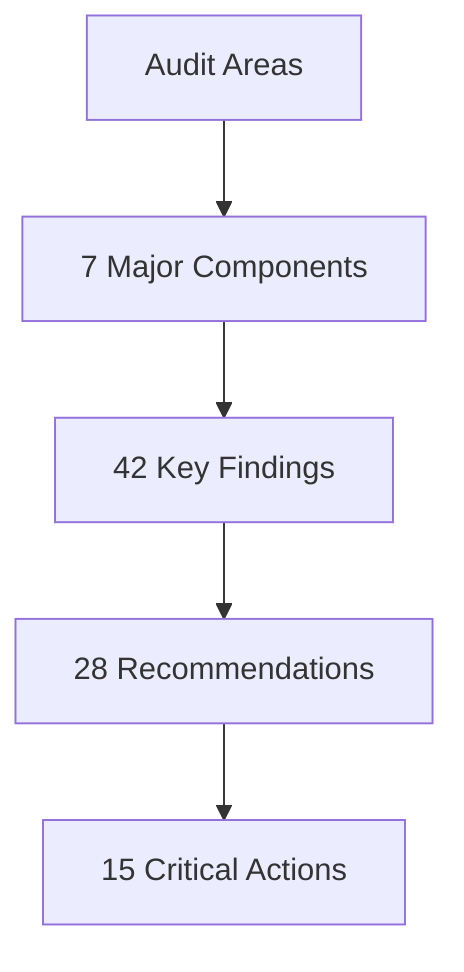

# Executive Summary - v0.1 Audit

## Overview

A comprehensive audit of the admin-cloudflare application has been completed, covering:
- Web Application Architecture
- API Worker Implementation
- Database Design
- Sync Services
- Data Flow Patterns
- Security Measures
- Technical Debt

### Key Metrics


## 1. Critical Findings

### High Priority
1. **Security**
   - Rate limiting needs enhancement
   - Error handling improvements required
   - Session management gaps
   - Security headers missing

2. **Performance**
   - Caching strategy optimization needed
   - Database schema improvements required
   - Connection pooling implementation
   - Edge caching missing

3. **Architecture**
   - Multi-tenant complexity in single-tenant context
   - State management migration needed
   - Data flow optimization required
   - Service isolation improvements

## 2. Key Recommendations

### Immediate Actions (0-30 days)
1. **Security Enhancements**
   ```typescript
   // Implement comprehensive rate limiting
   interface RateLimitConfig {
     routes: Record<string, {
       limit: number;
       window: number;
     }>;
   }
   ```

2. **Performance Optimization**
   ```typescript
   // Database schema updates
   created_at: integer('created_at').notNull(),
   updated_at: integer('updated_at').notNull(),
   ```

3. **Architecture Improvements**
   ```typescript
   // State management migration
   interface MigrationConfig {
     tables: string[];
     preserveQueries: boolean;
   }
   ```

### Short-term (30-90 days)
1. **Testing Infrastructure**
   - Implement comprehensive testing
   - Add performance benchmarks
   - Include security scans
   - Setup monitoring

2. **Documentation**
   - Update architecture docs
   - Create API documentation
   - Develop security guides
   - Establish standards

3. **Optimization**
   - Implement edge caching
   - Optimize database queries
   - Add connection pooling
   - Enhance error handling

### Long-term (90+ days)
1. **Architecture Evolution**
   - Complete TinyBase migration
   - Implement distributed systems
   - Enhance scalability
   - Improve maintainability

2. **Security Maturity**
   - Advanced monitoring
   - Automated scanning
   - Penetration testing
   - Security training

## 3. Migration Path

### Phase 1: Foundation (Weeks 1-4)
1. **Security**
   - Implement rate limiting
   - Add security headers
   - Enhance error handling
   - Improve session management

2. **Performance**
   - Update database schema
   - Implement connection pooling
   - Add basic caching
   - Optimize queries

### Phase 2: Enhancement (Weeks 5-12)
1. **Architecture**
   - Begin TinyBase migration
   - Implement edge caching
   - Add monitoring
   - Update documentation

2. **Testing**
   - Add unit tests
   - Implement integration tests
   - Setup performance tests
   - Add security scans

### Phase 3: Optimization (Weeks 13+)
1. **Advanced Features**
   - Complete state management migration
   - Implement distributed systems
   - Add advanced monitoring
   - Enhance security measures

## 4. Resource Requirements

### Development Effort
1. **High Priority**
   - Security fixes: 1-2 weeks
   - Performance optimization: 2-3 weeks
   - State management: 3-4 weeks

2. **Medium Priority**
   - Testing infrastructure: 2-3 weeks
   - Documentation: 1-2 weeks
   - Caching improvements: 1-2 weeks

### Infrastructure
1. **Development**
   - Testing environments
   - CI/CD pipelines
   - Monitoring tools
   - Security scanning

2. **Production**
   - Edge caching setup
   - Distributed rate limiting
   - Advanced monitoring
   - Security infrastructure

## 5. Risk Assessment

### Technical Risks
1. **High**
   - Security vulnerabilities
   - Performance bottlenecks
   - Data consistency
   - Migration complexity

2. **Medium**
   - Testing coverage
   - Documentation gaps
   - Caching efficiency
   - Error handling

### Mitigation Strategies
1. **Security**
   - Regular security audits
   - Automated scanning
   - Penetration testing
   - Security training

2. **Performance**
   - Regular benchmarking
   - Performance monitoring
   - Load testing
   - Optimization reviews

## 6. Success Metrics

### Key Performance Indicators
```typescript
interface SuccessMetrics {
  security: {
    rateLimitBreaches: number;
    vulnerabilities: number;
    incidentResponseTime: number;
  };
  performance: {
    responseTime: number;
    cacheHitRate: number;
    errorRate: number;
  };
  quality: {
    testCoverage: number;
    bugRate: number;
    techDebtMetrics: DebtMetrics;
  };
}
```

### Monitoring Plan
1. **Real-time Metrics**
   - Response times
   - Error rates
   - Security incidents
   - Resource usage

2. **Long-term Trends**
   - Performance trends
   - Security metrics
   - Quality indicators
   - Technical debt

## 7. Next Steps

### Immediate Actions
1. Review and prioritize recommendations
2. Create detailed implementation plans
3. Allocate resources and budget
4. Begin high-priority fixes

### Ongoing Process
1. Regular progress reviews
2. Metric tracking
3. Risk reassessment
4. Plan adjustments

[End of Executive Summary] 