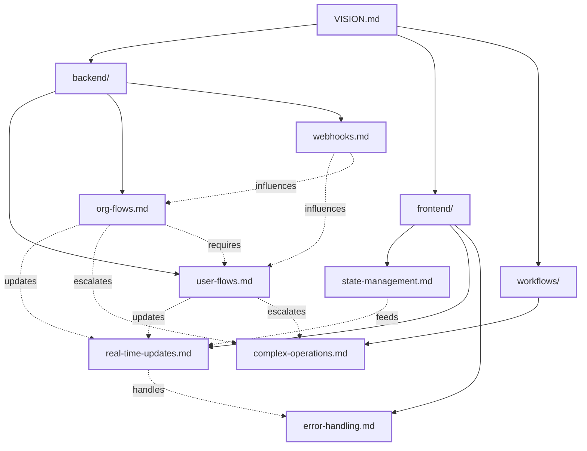

# Sync Services Vision

## Overview

Our sync services architecture is designed to maintain data consistency between our application and external services (primarily Clerk). It follows an event-driven approach with real-time updates and robust error handling.

For visual representations of our architecture and documentation structure, see [diagrams.md](./diagrams.md).

## Core Principles

### 1. Event-Driven Architecture
- Webhook-based synchronization
- Real-time updates to frontend
- Asynchronous processing
- Event-based state management

### 2. Data Consistency
- Strong validation at every step
- Transactional operations
- Idempotent processing
- Conflict resolution strategies

### 3. Real-Time First
- Immediate frontend updates
- WebSocket-based notifications
- Optimistic UI updates
- Fallback mechanisms

### 4. Robust Error Handling
- Comprehensive error tracking
- Automatic retry mechanisms
- Manual intervention paths
- Clear error reporting

## Information Flow

### Backend Processing
1. **Webhook Reception**
   - External service sends webhook
   - Validation and authentication
   - Event classification
   - Initial processing

2. **Data Synchronization**
   - State verification
   - Data transformation
   - Database operations
   - Cache updates

3. **Event Propagation**
   - WebSocket notifications
   - Cache invalidation
   - Search index updates
   - Audit logging

### Frontend Integration
1. **State Management**
   - Central store updates
   - Cache management
   - Optimistic updates
   - State reconciliation

2. **User Interface**
   - Real-time updates
   - Loading states
   - Error handling
   - Recovery flows

### Complex Operations
1. **Workflow Management**
   - Long-running tasks
   - State persistence
   - Progress tracking
   - Error recovery

2. **Resource Management**
   - Connection pooling
   - Rate limiting
   - Cache optimization
   - Performance monitoring

## Documentation Structure

Our documentation is organized into three main areas:

Legend:
- Solid lines: Directory structure
- Dotted lines: Document dependencies and relationships

1. **Backend Documentation** (`/backend`)
   - User synchronization flows
   - Organization synchronization flows
   - Webhook handling and processing

2. **Frontend Documentation** (`/frontend`)
   - State management patterns
   - Real-time update handling
   - Error handling strategies

3. **Workflow Documentation** (`/workflows`)
   - Complex operation patterns
   - Long-running task management
   - Resource optimization

## Success Metrics

### Performance
- Webhook processing time < 500ms
- Real-time update delivery < 100ms
- UI update time < 50ms
- Error recovery time < 1s

### Reliability
- 99.99% webhook processing success
- Zero data inconsistencies
- < 0.1% error rate
- 100% audit trail coverage

### Scalability
- Support for 1000+ concurrent users
- Handle 100+ webhooks/second
- Process 1M+ events/day
- Maintain performance under load 