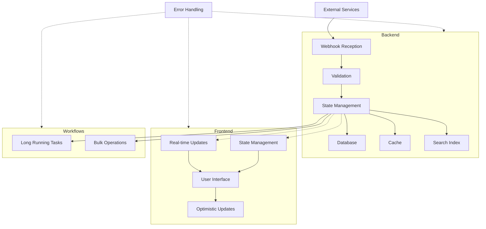
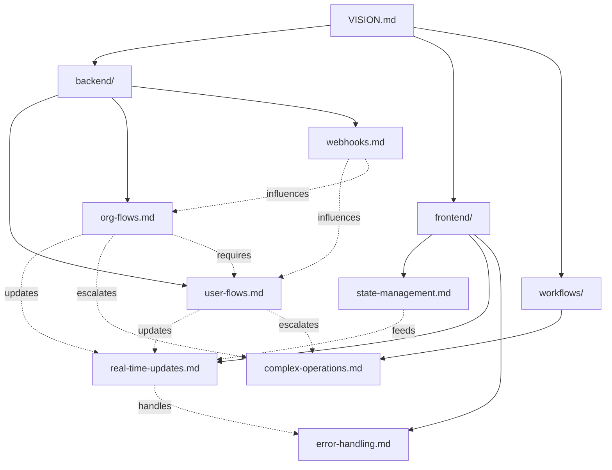

# System Diagrams

## System Architecture

## Documentation Structure

## Legend

### System Architecture
- Solid lines: Direct data flow
- Dotted lines: Indirect relationships/influences
- Boxes: System components
- Subgraphs: Logical groupings

### Documentation Structure
- Solid lines: Directory structure
- Dotted lines: Document dependencies and relationships
- Labels on dotted lines indicate the nature of the dependency 