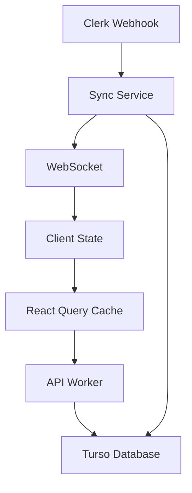

# Data Flow Audit

## 1. Current State

### Overview
- Client-side state management with React Query
- Server-side data flow through API Workers
- Event-driven sync with Clerk
- Edge database with Turso

### Data Flow Patterns


### Key Components
1. **Client Layer**
   - React Query for server state
   - TanStack Router for routing
   - WebSocket for real-time updates
   - Local caching

2. **API Layer**
   - Hono-based API Workers
   - Type-safe endpoints
   - Authentication middleware
   - Request validation

3. **Sync Layer**
   - Webhook processing
   - Event handling
   - Data transformation
   - Cache invalidation

### Documentation References
- [Type Safety](../notebooks/TYPE-SAFETY.md)
- [Sync Services](../notebooks/SYNC_SERVICES.md)
- [Database](../notebooks/DATABASE.md)
- [Auth](../notebooks/AUTH.md)

## 2. Data Flow Analysis

### Client to Server
1. **Request Flow**
   ```typescript
   // React Query pattern
   const { data } = useQuery({
     queryKey: ['users'],
     queryFn: async () => {
       const response = await api.users.list();
       return response.data;
     }
   });
   ```

2. **Caching Strategy**
   - Stale-while-revalidate
   - Background updates
   - Optimistic updates
   - Cache invalidation

3. **Real-time Updates**
   - WebSocket connections
   - Event subscriptions
   - UI synchronization
   - Error recovery

### Server to Database
1. **Query Patterns**
   ```typescript
   // Type-safe database queries
   const users = await db
     .select()
     .from(users)
     .where(eq(users.organizationId, orgId))
     .all();
   ```

2. **Transaction Flow**
   - ACID compliance
   - Rollback support
   - Error handling
   - Connection management

### External Service Integration
1. **Clerk Integration**
   - Authentication flow
   - User management
   - Organization sync
   - Webhook processing

2. **Event Processing**
   - Validation
   - Transformation
   - Database updates
   - Cache invalidation

## 3. Findings

### Strengths
1. **Type Safety**
   - End-to-end type safety
   - Runtime validation
   - Schema consistency
   - Error type handling

2. **Data Consistency**
   - Transaction support
   - Optimistic updates
   - Real-time sync
   - Cache management

3. **Developer Experience**
   - Clear data flow
   - Type inference
   - Error handling
   - Debugging support

### Issues
1. **Performance**
   - Multiple round trips
   - Cache invalidation overhead
   - Redundant data fetching
   - Connection management

2. **Scalability**
   - WebSocket limitations
   - Connection pool limits
   - Memory pressure
   - Event processing bottlenecks

3. **Complexity**
   - State management overhead
   - Cache coordination
   - Error recovery
   - Real-time sync complexity

## 4. Analysis

### Impact Assessment
1. **Performance Impact**
   - Client-side latency
   - Server processing time
   - Database load
   - Network overhead

2. **Resource Usage**
   - Memory consumption
   - Connection pools
   - Worker resources
   - Cache storage

3. **Developer Burden**
   - State management
   - Type maintenance
   - Error handling
   - Testing complexity

### Dependencies Affected
1. **Frontend**
   - React Query usage
   - WebSocket handling
   - Error boundaries
   - Loading states

2. **Backend**
   - API endpoints
   - Database queries
   - Cache management
   - Event processing

## 5. Recommendations

### Immediate Actions
1. Implement data batching
2. Optimize cache strategy
3. Add request coalescing
4. Enhance error recovery

### Long-term Improvements
1. GraphQL consideration
2. Edge caching
3. Query optimization
4. State management refinement

### Implementation Approach
1. **Data Batching**
   ```typescript
   interface BatchConfig {
     maxBatchSize: number;
     waitTime: number;
     retryStrategy: 'immediate' | 'exponential';
   }
   ```

2. **Cache Strategy**
   ```typescript
   interface CacheConfig {
     level: 'memory' | 'edge' | 'distributed';
     ttl: number;
     invalidation: 'precise' | 'group';
   }
   ```

3. **Request Coalescing**
   ```typescript
   interface CoalesceConfig {
     window: number;
     maxRequests: number;
     keyGenerator: (request: Request) => string;
   }
   ```

### Effort Estimates
1. Data Batching: 3-4 days
2. Cache Strategy: 4-5 days
3. Request Coalescing: 2-3 days
4. Error Recovery: 2-3 days

### Priority Levels
1. **High**
   - Data batching
   - Cache optimization
   - Error recovery

2. **Medium**
   - Request coalescing
   - Edge caching
   - Query optimization

3. **Low**
   - GraphQL migration
   - State refinement
   - Developer tooling

[End of Data Flow audit] 