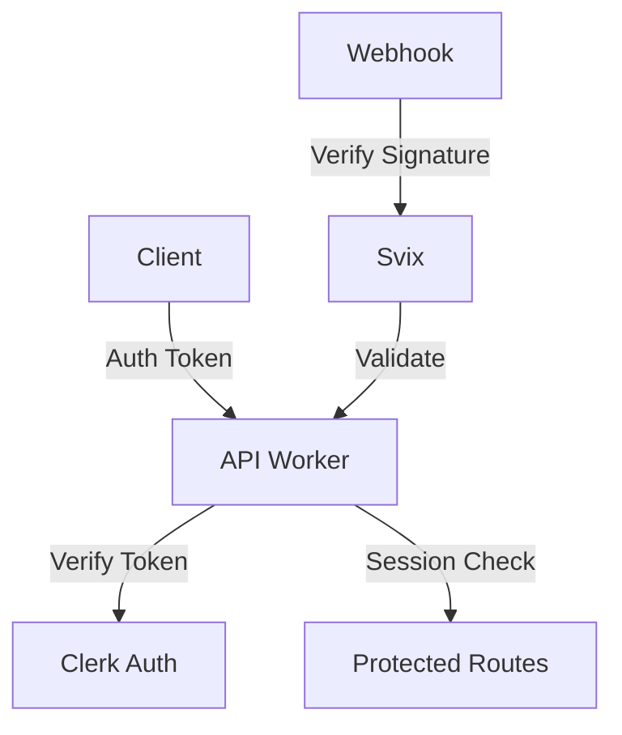

# Security Audit

## 1. Current State

### Security Components
- **Clerk** - Authentication and user management
- **Hono Middleware** - Request validation and auth
- **Svix** - Webhook signature verification
- **Protected Routes** - Access control

### Security Architecture


### Key Features
1. **Authentication**
   - Token-based auth
   - Session management
   - Multi-tenant support
   - Custom auth pages

2. **Authorization**
   - Role-based access
   - Organization scoping
   - Protected routes
   - Resource isolation

3. **API Security**
   - Request validation
   - CORS protection
   - Rate limiting
   - Error handling

### Protected Resources
```
apps/api/src/
├── middleware/
│   ├── auth.ts         # Authentication middleware
│   └── organization.ts # Organization context
├── env.ts             # Environment configuration
└── lib/
    └── response.ts    # Secure response wrapper
```

## 2. Security Measures

### Authentication Flow
1. **Client-side**
   ```typescript
   // Token management
   const { getToken } = useAuth();
   const token = await getToken();
   
   // Request with auth
   const response = await fetch(url, {
     headers: {
       Authorization: `Bearer ${token}`,
     },
   });
   ```

2. **Server-side**
   ```typescript
   // Auth middleware
   app.use('*', async (c, next) => {
     const auth = await verifyAuth(c);
     if (!auth.userId) {
       return c.json({ error: 'Unauthorized' }, 401);
     }
     await next();
   });
   ```

### Webhook Security
1. **Signature Verification**
   ```typescript
   const wh = new Webhook(c.env.CLERK_WEBHOOK_SECRET);
   await wh.verify(rawBody, {
     'svix-id': svixId,
     'svix-timestamp': svixTimestamp,
     'svix-signature': svixSignature
   });
   ```

2. **Request Validation**
   - Header checks
   - Timestamp validation
   - Rate limiting
   - Payload validation

## 3. Findings

### Strengths
1. **Authentication**
   - Comprehensive token management
   - Secure session handling
   - Multi-factor support
   - Audit logging

2. **API Protection**
   - Strong middleware stack
   - Type-safe validation
   - Error boundaries
   - Rate limiting

3. **Infrastructure**
   - Edge security
   - Webhook verification
   - Environment isolation
   - Secret management

### Vulnerabilities
1. **Rate Limiting**
   - Basic implementation
   - Per-route gaps
   - Distributed bypass risk
   - Limited monitoring

2. **Error Exposure**
   - Detailed error messages
   - Stack trace leakage
   - Status code consistency
   - Error aggregation

3. **Session Management**
   - Token refresh handling
   - Session timeout config
   - Concurrent session limits
   - Revocation delays

## 4. Analysis

### Risk Assessment
1. **High Risk**
   - Rate limit bypass
   - Error information exposure
   - Token management
   - Webhook replay attacks

2. **Medium Risk**
   - Session handling
   - CORS configuration
   - Cache poisoning
   - Resource exhaustion

3. **Low Risk**
   - UI security
   - Logging exposure
   - Development artifacts
   - Documentation security

### Impact Analysis
1. **Authentication Impact**
   - Token compromise scope
   - Session hijacking risk
   - Multi-tenant isolation
   - Data access control

2. **API Security Impact**
   - Rate limit effectiveness
   - Error information leakage
   - Request forgery risk
   - Resource consumption

## 5. Recommendations

### Immediate Actions
1. Enhance rate limiting
2. Improve error handling
3. Strengthen session management
4. Add security headers

### Long-term Improvements
1. Security monitoring
2. Automated scanning
3. Penetration testing
4. Security training

### Implementation Approach
1. **Rate Limiting**
   ```typescript
   interface RateLimitConfig {
     routes: {
       [path: string]: {
         limit: number;
         window: number;
         errorResponse: ErrorResponse;
       };
     };
     storage: 'memory' | 'kv';
     distributed: boolean;
   }
   ```

2. **Error Handling**
   ```typescript
   interface SecurityError {
     code: string;
     publicMessage: string;
     internalDetails?: unknown;
     severity: 'low' | 'medium' | 'high';
   }
   ```

3. **Security Headers**
   ```typescript
   interface SecurityHeaders {
     'Content-Security-Policy': string;
     'X-Frame-Options': string;
     'X-Content-Type-Options': string;
     'Referrer-Policy': string;
   }
   ```

### Effort Estimates
1. Rate Limiting: 3-4 days
2. Error Handling: 2-3 days
3. Session Management: 2-3 days
4. Security Headers: 1-2 days

### Priority Levels
1. **Critical**
   - Rate limiting enhancement
   - Error handling improvement
   - Session management

2. **High**
   - Security headers
   - Monitoring setup
   - Scanning implementation

3. **Medium**
   - Training program
   - Documentation updates
   - Testing automation

[End of Security audit] 