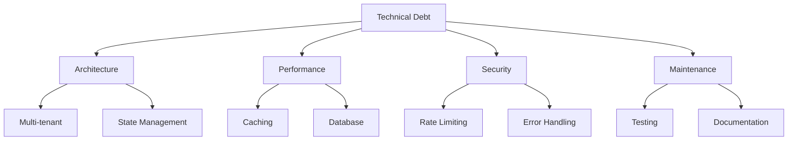

# Technical Debt Audit

## 1. Current State

### Overview
Technical debt has accumulated across several areas:
- Multi-tenant complexity in single-tenant context
- React Query to TinyBase migration needs
- Schema optimization requirements
- Security implementation gaps
- Performance optimization needs

### Debt Categories


### Documentation References
- [Web Application Audit](./WEB.md)
- [API Worker Audit](./API_WORKER.md)
- [Database Audit](./DATABASE.md)
- [Security Audit](./SECURITY.md)
- [Data Flow Audit](./DATA_FLOW.md)
- [Sync Services Audit](./SYNC.md)

## 2. Debt Analysis

### Architecture Debt
1. **Multi-tenant Complexity**
   ```typescript
   // Current: Complex organization context
   const OrganizationProvider = ({ children }) => {
     // ... complex organization state management
     // ... webhook synchronization
     // ... caching logic
   };
   ```

2. **State Management**
   ```typescript
   // Current: React Query implementation
   const useUsers = () => {
     return useQuery(['users'], fetchUsers);
   };
   
   // Needed: TinyBase migration
   const useUsers = () => {
     const store = useStore();
     return store.getTable('users');
   };
   ```

### Performance Debt
1. **Caching Issues**
   - Multiple cache layers
   - Inconsistent invalidation
   - No edge caching
   - Memory pressure

2. **Database Optimization**
   ```typescript
   // Current: Text-based timestamps
   created_at: text('created_at').notNull(),
   
   // Needed: Proper timestamp columns
   created_at: integer('created_at').notNull(),
   ```

### Security Debt
1. **Rate Limiting**
   - Basic implementation
   - Missing distributed support
   - Incomplete route coverage
   - Limited monitoring

2. **Error Handling**
   - Inconsistent error formats
   - Potential information leakage
   - Missing error boundaries
   - Incomplete logging

### Maintenance Debt
1. **Testing Coverage**
   - Incomplete unit tests
   - Missing integration tests
   - No performance tests
   - Limited security tests

2. **Documentation Gaps**
   - Outdated architecture docs
   - Missing API documentation
   - Incomplete security guides
   - Limited onboarding docs

## 3. Impact Analysis

### Business Impact
1. **Development Velocity**
   - Complex state management
   - Technical complexity
   - Maintenance overhead
   - Onboarding difficulty

2. **User Experience**
   - Performance issues
   - Caching inconsistencies
   - Error handling gaps
   - Security vulnerabilities

3. **Maintenance Cost**
   - Complex debugging
   - Difficult updates
   - Testing overhead
   - Documentation maintenance

### Risk Assessment
1. **High Risk**
   - Security vulnerabilities
   - Performance bottlenecks
   - Data consistency issues
   - State management complexity

2. **Medium Risk**
   - Testing coverage
   - Documentation gaps
   - Caching inefficiencies
   - Error handling

3. **Low Risk**
   - UI inconsistencies
   - Code organization
   - Development tooling
   - Minor optimizations

## 4. Remediation Plan

### Immediate Actions
1. **Security Fixes**
   ```typescript
   // Implement proper rate limiting
   interface RateLimitConfig {
     routes: Record<string, {
       limit: number;
       window: number;
     }>;
   }
   ```

2. **Performance Optimization**
   ```typescript
   // Add edge caching
   interface CacheConfig {
     edge: boolean;
     ttl: number;
     invalidation: 'precise' | 'group';
   }
   ```

3. **State Management**
   ```typescript
   // Begin TinyBase migration
   interface MigrationConfig {
     tables: string[];
     preserveQueries: boolean;
     backupStrategy: 'none' | 'memory' | 'storage';
   }
   ```

### Long-term Improvements
1. **Testing Infrastructure**
   ```typescript
   // Add comprehensive testing
   interface TestConfig {
     unit: boolean;
     integration: boolean;
     performance: boolean;
     security: boolean;
   }
   ```

2. **Documentation**
   ```typescript
   // Implement documentation system
   interface DocConfig {
     api: boolean;
     architecture: boolean;
     security: boolean;
     deployment: boolean;
   }
   ```

### Effort Estimates
1. **High Priority**
   - Security fixes: 1-2 weeks
   - Performance optimization: 2-3 weeks
   - State management: 3-4 weeks

2. **Medium Priority**
   - Testing infrastructure: 2-3 weeks
   - Documentation: 1-2 weeks
   - Caching improvements: 1-2 weeks

3. **Low Priority**
   - Code organization: 1 week
   - Development tooling: 1 week
   - Minor optimizations: 1 week

## 5. Prevention Strategy

### Process Improvements
1. **Code Review**
   - Security checklist
   - Performance review
   - Architecture review
   - Documentation requirements

2. **Testing Requirements**
   - Unit test coverage
   - Integration test coverage
   - Performance benchmarks
   - Security scans

3. **Documentation Standards**
   - API documentation
   - Architecture updates
   - Security guidelines
   - Deployment guides

### Monitoring
1. **Performance Metrics**
   ```typescript
   interface PerformanceMetrics {
     responseTime: number;
     cacheHitRate: number;
     errorRate: number;
     resourceUsage: ResourceMetrics;
   }
   ```

2. **Security Monitoring**
   ```typescript
   interface SecurityMetrics {
     rateLimitBreaches: number;
     authFailures: number;
     vulnerabilityScans: ScanResult[];
     securityIncidents: Incident[];
   }
   ```

3. **Technical Debt Tracking**
   ```typescript
   interface DebtMetrics {
     category: 'security' | 'performance' | 'maintenance';
     severity: 'high' | 'medium' | 'low';
     effort: number;
     impact: 'high' | 'medium' | 'low';
   }
   ```

[End of Technical Debt audit] 